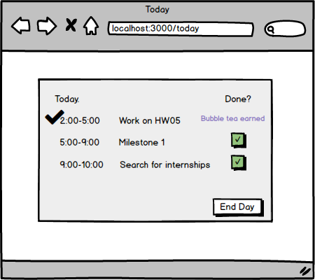

# Steady Day

## Overview

When massive amounts of work and pressure piles up on you, it can be hard to stay motivated. When faced with a neverending list of things-to-do, sometimes you may spend the day doing none of it at all! This is where Steady Day can help, by transforming your day into a steady and *rewarding* one using the power of short-term motivation.

Steady Day is a web app that will allow users to plan out tasks for their day and set rewards for particular tasks. Once users log in, they can plan out their day or, if they already made a plan previously, view their most recent plan. On the plan page, users can mark tasks as done and its corresponding reward will show up. Users can choose "End Day" at the end of the day and an overview of their day including the tasks they accomplished and the time spent on each task will show up. 


## Data Model

The application will store Users, Rewards, and Tasks.

* User will be used when logging in normally
* Each User can have multiple Tasks
* Task represents a task the user plans to accomplish 
* Rewards can be assigned to tasks

An Example User:

```javascript
{
  Id: "stressedstudent",
  password: // a password hash,
  tasks: // an array of references to Task documents
  rewards: // an array of references to Reward documents
}
```

An Example Reward:

```javascript
{
  info: "jelly",
}
```

An Example Task:

```javascript
{
  info: "Work on HW05",
  reward: "bubble tea"
  done: {type: Number, default: -1}      //1 for done, -1 for not done
}
```

## [Link to Commented First Draft Schema](db.js) 

## Wireframes

/ - page for logging in


/register - page for registering


/plan - page for adding tasks 


/today - page for displaying and checking off tasks



/overview - page for showing overview of day (tasks done etc.)


## Site map

Here's a [sitemap](documentation/sitemap.png).

## User Stories or Use Cases

1. as a non-registered user, I can register a new account with the site
2. as a non-registered user, I can sign in with Facebook and become a user
3. as a user, I can log in to the site
4. as a user, I can add tasks
5. as a user, I can set rewards for each task
6. as a user, I can check off items on my task list
7. as a user, I can look at an overview of tasks accomplished

## Research Topics

* (5 + 2 points) Integrate user authentication - Passport
    * Passport is an authentication middleware. It has different authentication mechanisms, known as strategies, that can be used.
    * A serialized user object can be found at req.session.passport.user
    * Signup and registration is implemented as well as FB Connect.
* (2 points) chartist.js
    * Chartist is a charting libary that supports responsive charts. It can produce really neat looking animated charts.
    * I used chartist.js to create a pie chart that shows the ratio of complete and incomplete tasks.

9 points total out of 8 required points 


## [Link to Initial Main Project File](app.js) 

## Annotations / References Used
                                                                                                                                                                                                                                                                                                                                                                                                                                                                                                                                                                                                                                                                                                                                                                                                                                                                                                                                                                                                                                                                                                                                                                                                                                                                                                                                                                                                                                                                                                                                                                                                                                                                                                                                                                                                                                                                                                                                                                                                                                                                                                                                                                                                                                                                                                                                                                                                                                                                                                                                                                                                                                                                                                                                                                                                                                                                                                                                                                                                                                                                                                                                                                                                                                                                                                                                                                                                                                                                                                                                                                                                                                                                                                                                                                                                                                                                                                                                                                                                                                                                                                                                                                                                                                                                                                                                                                                                                                                                                                                                                                                                                                                                                                                                                                                                                                                                                                                                                                                                                                                                                                                                                                                                                                                                                                                                                                                                                                                                                                                                                                                                                                                                                                                                                                                                                                                                                                                                                                                                                                                                                                                                                                                                                                                                                                                                                                                                                                                                                                                                                                                                                                                                                                                                                                                                                                                                                                                                                                                                                                                                                                                                                                                                                                                                                                                                                                                                                                                                                                                                                                                                                                                                                                                                                                                                                                                                                                                                                                                                                                                                                                                                                                                                                                                                                                                                                                                                                                                                                                                                                                                                                                                                                                                                                                                                                                                                                                                                                      
1. [passport.js authentication docs](http://passportjs.org/docs) - [passport tutorial](https://code.tutsplus.com/tutorials/authenticating-nodejs-applications-with-passport--cms-21619) - [passport facebook auth tutorial](https://code.tutsplus.com/articles/social-authentication-for-nodejs-apps-with-passport--cms-21618)
2. [chartist examples](http://gionkunz.github.io/chartist-js/examples.html#simple-pie-chart) 
